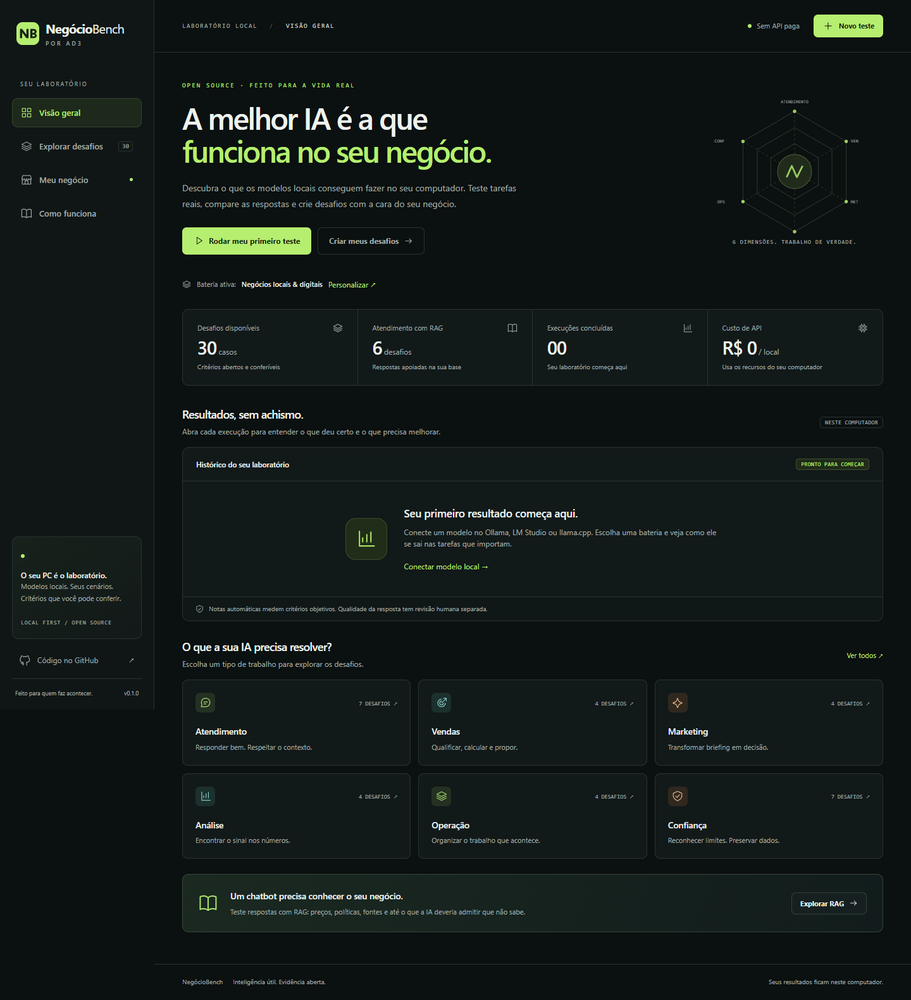

# NegócioBench — por AD3

**Qual IA local funciona no seu PC e no seu negócio?**

Um laboratório open source, em português, para testar modelos locais em tarefas de negócios, conferir respostas e criar suas próprias baterias. Roda no seu computador, com Python e navegador, sem dependências de terceiros ou APIs pagas.

## Comece entregando o repositório à sua IA

**O NegócioBench foi preparado para ser operado por agentes de IA com acesso ao terminal.** A IA lê as instruções, diagnostica o ambiente, ajuda a criar os testes e executa a bateria. Você acompanha as evidências no painel.

Cole este pedido no agente que você usa:

> Use https://github.com/Ad3Digital/negociobench para descobrir quais IAs locais funcionam no meu PC e no meu negócio. Leia o AGENTS.md e conduza o processo. Confira o ambiente e os modelos já instalados, me ajude a criar uma bateria pequena com fatos do meu negócio, valide os testes e rode uma primeira comparação local. Pergunte somente o que faltar. Antes de instalar programas ou baixar modelos, explique o necessário. Não use APIs pagas nem publique meus dados. Ao terminar, abra o painel e explique os resultados e as limitações.

**Para a IA:** comece pelo [AGENTS.md](AGENTS.md) e pelo [guia de operação por agentes](docs/AGENTES.md). A CLI `agent.py` oferece diagnóstico, descoberta de modelos, validação, execução e relatórios em JSON.

Um chatbot sem acesso ao terminal pode preparar os testes e orientar você; a execução exige uma ferramenta com acesso ao computador. A operação manual também está explicada abaixo.

## De onde vem o projeto

Sou Antonio, da AD3. Uso IA no meu negócio local e na minha agência de IA. É dessa rotina — atendimento, vendas, marketing e operação — que nasce o NegócioBench.

Quero entender quais modelos locais ajudam no trabalho de verdade, dentro das condições do meu computador. Abri o projeto para que outros empreendedores e alunos possam fazer a mesma investigação: criar testes com o contexto do próprio negócio e conferir as respostas, o tempo e as limitações de cada modelo.

Os casos públicos usam dados fictícios inspirados nesses tipos de tarefa. Resultados de desempenho só entram depois de uma execução; a experiência na operação não substitui a medição.



## Instalação e uso manual

Requisitos: **Python 3.10+**, navegador atualizado e, para inferência, um servidor local compatível com Chat Completions. Não é necessário instalar pacotes Python.

```sh
git clone https://github.com/Ad3Digital/negociobench.git
cd negociobench
python bench.py
```

No Windows, use `py -3 bench.py` ou abra **INICIAR-WINDOWS.cmd**. No macOS/Linux, use `python3 bench.py`. O navegador abre em **http://127.0.0.1:8769**.

1. Abra o Ollama, LM Studio ou llama.cpp com um modelo local.
2. No painel, clique em **Novo teste**, escolha o servidor e **Buscar modelos**.
3. Selecione modelos, bateria e repetições. Registre GPU/CPU, RAM, quantização e contexto.
4. Clique em **Iniciar benchmark**. Nada roda antes dessa ação.
5. Abra os resultados, confira cada resposta e registre sua avaliação humana.

Não precisa testar vários modelos de uma vez. Comece com um, usando a bateria rápida. O programa não baixa modelos, não muda sua configuração de GPU e não inicia servidores de inferência.

| Servidor | Endereço padrão |
|---|---|
| Ollama | `http://127.0.0.1:11434/v1` |
| LM Studio | `http://127.0.0.1:1234/v1` |
| llama.cpp (`llama-server`) | `http://127.0.0.1:8080/v1` |

O servidor deve oferecer `/models` e `/chat/completions`, aceitar `messages`, `temperature`, `max_tokens` e `stream: false`. Não exigimos function calling ou JSON mode. Compatibilidade com o protocolo não garante que todo modelo siga o formato pedido.

Fontes do protocolo: [Ollama](https://docs.ollama.com/api/openai-compatibility), [LM Studio](https://lmstudio.ai/docs/developer/openai-compat), [llama.cpp server](https://github.com/ggml-org/llama.cpp/tree/master/tools/server).

## O que vem pronto

- **29 casos de negócios** em atendimento, vendas, marketing, análise, operação e confiança.
- **5 casos de documento longo**: uma NF-e fictícia de 12 itens colada inteira no briefing, para medir o que acontece quando o modelo precisa achar o item certo, ratear custo, ler a situação tributária campo a campo e não inventar o que a nota não traz.
- **6 casos de RAG**: preço e política, agenda, acesso a curso, versões conflitantes, informação ausente e prompt injection.
- **Base sintética de 10 documentos**, busca lexical BM25 local e fontes visíveis por resposta.
- Perfis rápido, negócios, documento longo, RAG e completo; execução sequencial de até oito modelos e até cinco repetições.
- Comparação de critérios objetivos, tempo ponta a ponta, tokens informados pelo runtime e falhas.
- Revisão humana de utilidade, clareza e fidelidade, mantida separada da nota automática.
- Importação/exportação de baterias próprias e exportação de relatórios JSON.
- Instruções para agentes e CLI com saída JSON para conduzir o processo pelo terminal.

Não há ranking público pré-preenchido. Nenhum modelo foi avaliado para produzir números de marketing. Os resultados começam vazios.

## RAG: onde entram PostgreSQL e pgvector?

**O RAG desta versão usa BM25, uma busca por palavras nos documentos da bateria.** Ele funciona localmente, sem banco de dados ou modelo de embeddings.

Para quem estuda ou usa RAG com PostgreSQL, vale conhecer o **[pgvector](https://github.com/pgvector/pgvector)**: uma extensão que permite guardar vetores e pesquisar por proximidade dentro do próprio Postgres. Um modelo de embeddings transforma os textos em vetores; a busca seleciona trechos que serão entregues ao modelo que responde.

RAG é o fluxo de recuperar conhecimento e usá-lo na resposta. A recuperação pode ser lexical, vetorial ou uma combinação das duas. **PostgreSQL + pgvector ainda não está integrado ao NegócioBench.** Os testes atuais não medem o desempenho desse banco nem reproduzem uma aplicação do curso que o utilize.

**[Entenda o fluxo e como relacioná-lo aos seus testes](docs/RAG-E-PGVECTOR.md)**

## Crie os testes do seu negócio

Abra **Meu negócio**. Baixe o exemplo JSON, adapte os fatos ou use o gerador de prompt para pedir ajuda a uma IA. Revise os gabaritos e importe o arquivo.

**[Guia completo: criar casos, montar a base RAG e rodar comparações](docs/CRIAR-TESTES.md)**

Você também pode iniciar diretamente com uma bateria:

```sh
python bench.py --suite /caminho/meu-negocio.json
python bench.py --suite /caminho/meu-negocio.json --self-check
```

Importações e resultados ficam em `.local/`, ignorado pelo Git. Baterias importadas aparecem em **Baterias salvas neste PC**. Ao reiniciar sem `--suite`, a bateria AD3 é selecionada; seus arquivos permanecem salvos. Trocar a bateria mostra somente resultados da mesma versão, sem apagar os demais.

## Entenda o resultado

O score automático verifica **campos objetivos**, não a qualidade integral de uma conversa. Um modelo pode preencher os campos corretamente e escrever uma resposta ruim. Leia o texto e use a revisão humana.

Cada critério tem o mesmo peso dentro do caso. Falha em campo crítico zera o caso. A nota geral é a média das médias por categoria. Timeout e falhas de servidor recebem zero e são identificados separadamente. Execuções parciais mostram cobertura e não são comparáveis a execuções completas.

Compare execuções com o mesmo **código de protocolo** e configuração de hardware/runtime equivalente. Os hashes incluem bateria, documentos, prompt, versão, parâmetros e casos. A versão do servidor, a quantização e o contexto precisam ser anotados por você. Temperatura zero não garante determinismo em todos os runtimes.

**[Metodologia e limites](docs/METODOLOGIA.md)**

## Local, privado e reproduzível

- Aplicativo e inferência usam somente loopback. Não é aceito endereço remoto, redirecionamento ou proxy configurado no ambiente.
- Tags identificáveis como cloud no Ollama são recusadas e a listagem local de pesos é conferida. Use um runtime de confiança: um proxy local pode ocultar sua própria conexão externa.
- Não há telemetria, fonte remota, biblioteca CDN ou chave de API.
- O benchmark não executa comandos produzidos por modelos nem código nos arquivos importados.
- Relatórios exportados incluem prompts, documentos recuperados, respostas e avaliação. Revise os dados antes de compartilhar.
- Não hospede o servidor de desenvolvimento em uma interface pública. Ele foi projetado para uma pessoa no próprio computador.
- Acesso ao GitHub e links externos é opcional. O uso com modelos já instalados funciona sem internet.

## Verificação sem usar a GPU

```sh
python bench.py --self-check
python -m unittest discover -s tests -v
```

Os testes usam um servidor de inferência falso, local e determinístico. Eles verificam o aplicativo; **não são resultados de um modelo**. Não chamam LLMs, não baixam pesos e não consomem API.

## Contribuir

Leia [CONTRIBUTING.md](CONTRIBUTING.md). Novos casos precisam de fatos sintéticos, gabarito revisado e critérios verificáveis. Não envie dados reais de clientes ou resultados sem contexto de hardware e protocolo.

Inspirado em rotinas de negócios e nos experimentos internos de avaliação da AD3. O conteúdo publicado foi reescrito com dados fictícios; não inclui vault, credenciais, clientes ou resultados privados.

**Licença MIT.** Código e casos incluídos estão disponíveis para usar, adaptar e compartilhar. Modelos executados têm suas próprias licenças.
