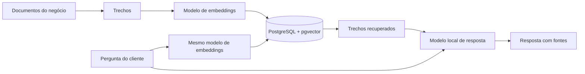

# RAG, PostgreSQL e pgvector

Se você aprendeu a montar atendimento com uma base de conhecimento no PostgreSQL, essa arquitetura tem relação direta com o que queremos avaliar: encontrar a informação certa e responder de forma útil.

## O papel de cada peça

**PostgreSQL** guarda os dados. A extensão **pgvector** acrescenta armazenamento e busca por proximidade de vetores. Ela oferece buscas exatas e aproximadas, incluindo índices HNSW e IVFFlat. [Documentação oficial do pgvector](https://github.com/pgvector/pgvector).

**Um modelo de embeddings** transforma texto em uma lista de números usada na busca por similaridade. O Ollama pode gerar esses vetores localmente; use o mesmo modelo de embeddings para documentos e perguntas. [Documentação de embeddings do Ollama](https://docs.ollama.com/capabilities/embeddings).

**O modelo de resposta** recebe a pergunta e os trechos recuperados para redigir a resposta. O modelo de embeddings e o modelo de resposta têm funções diferentes.

Esse é um exemplo de arquitetura vetorial. RAG também pode usar recuperação por palavras ou combinar os dois tipos de busca.

## Como funciona no NegócioBench hoje

O motor atual usa **BM25 em memória**, buscando palavras em documentos JSON. Não abre conexão com PostgreSQL, não gera embeddings e não executa pgvector. Essa escolha permite começar sem instalar banco nem baixar outro modelo.

O relatório mostra os documentos recuperados e as fontes citadas. Assim, você pode investigar se faltou contexto ou se o modelo interpretou mal a informação disponível. A revisão humana confere a fidelidade do texto.

## Como aproveitar o conteúdo do curso

Você pode transformar as mesmas perguntas, políticas e regras do seu exercício de atendimento em uma bateria própria. Use o [guia de criação de testes](CRIAR-TESTES.md), revise os gabaritos e compare os modelos com os mesmos casos.

Importar os textos da sua base para o JSON testa as respostas com a recuperação BM25 do benchmark. **Isso não testa a recuperação do seu pgvector.** A v0.1 ainda não tem adaptador para essa integração.

Para uma avaliação futura da arquitetura vetorial, o protocolo precisaria registrar modelo de embeddings, divisão dos textos, documentos, top-K, filtros, métrica de distância e configuração de índice. Também seria preciso medir recuperação e geração separadamente. Mudar essas escolhas junto com o modelo de resposta dificulta identificar de onde veio uma melhora ou piora.

Comece pela pergunta de negócio: “a resposta ficou correta, útil e rápida o suficiente?”. Depois use as evidências para localizar o que precisa melhorar na busca ou na geração.
